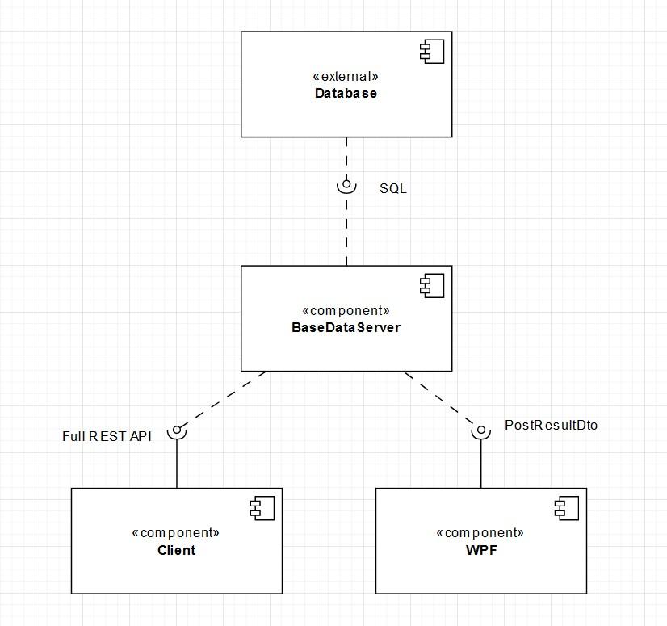
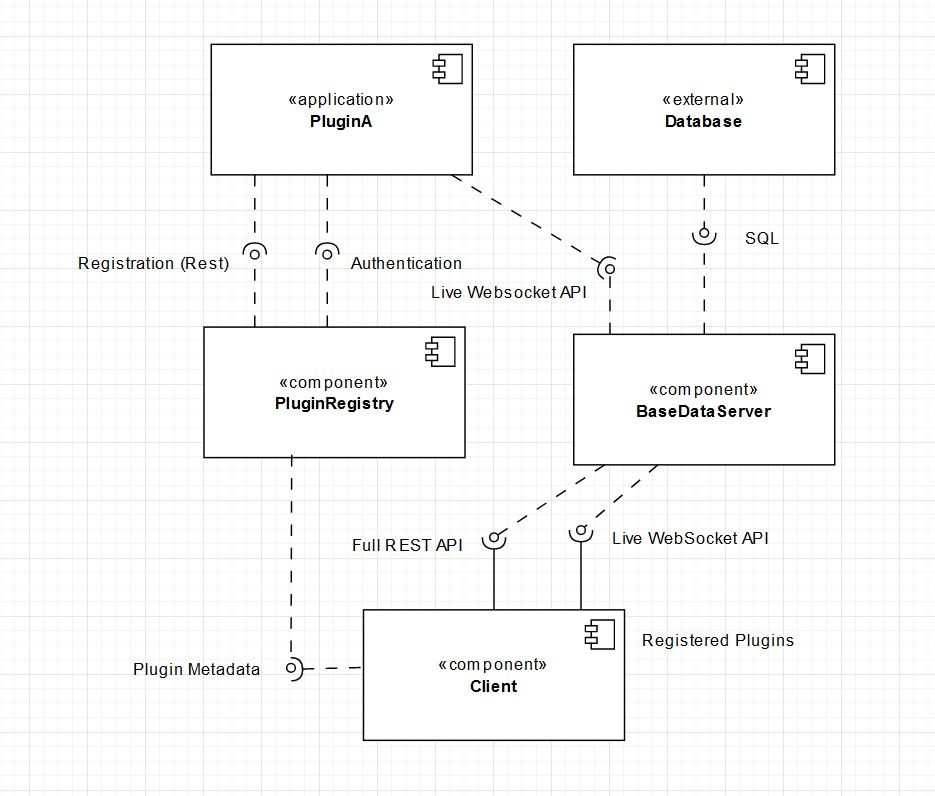

# Skriptum
Base data provider and client for web blogs

## About 📑
This repository contains the source code for Skriptum, a very barebones blogging platform built with extensibility in mind.

### Technology ⚙
Tech | Description
------------------- | --------
[](https://asp.net/) | Fast, modular web framework for the .NET platform
[](https://github.com/dotnet/wpf) | A windows-only desktop framework
[](https://react.dev/) | Component framework for JavaScript
[](https://redux.js.org/) | A state container for JavaScript based on the Flux pattern
[](https://redux.js.org/) | JavaScript, but type-safe

## Releases 📰
There are currently no finished releases available for the project. The basic features work (blogging and so on) but I do not consider the project ready for a realease until the plugin and component support (detailed below) is ready.

## Local setup 🆕
To develop for this project locally, you will need:

### Dependencies
- Visual Studio (tested with version 2022)
- Node.js (tested with version 18.14)
- npm (tested with version 9.3.1)
- Docker _or_ a local PostgresSQL database

### Server
To start the server, a working PostgreSQL database is needed. It is **strongly** advised to use a temporary database (such as Docker Postgres) as the migrations overwrite any previous data.

To start a new Postgres instance with Docker, run
```docker run -p 5432:5432 -e POSTGRES_PASSWORD=password postgres```.

After the database is started, you have to apply the server's schema to the database. This can be done in the Package Manage Console in Visual Studio using `Update-Database`.

You should now be able to start the server in it's development profile through Visual Studio.

### Client
#### Install dependencies
In the Client directory, run
```npm i```

If there are any peer-dependency errors, try again with `--force`. This is a known problem caused by the fact that the `@material-ui/icons` dependency does not support the lastest React version.

#### Run the client
You can now run the client using
```npm run start```

If you want to build it for production, this can be done using
```npm run build```

### WPF
> **Warning**
> The WPF client is read only and will likely not be significantly updated in the future

To start the WPF client, you only have to start it in its development profile in Visual Studio.

## Architecture and prospects
The current (unfinished) architecture looks like this:


There is only one server that supplies all the data to the clients.

> **NOTE**
> Internally, the data anc code in the server and web client is split up into many logical slices and components

In the future, the whole project will be amended by a plugin system.

### Plugins
- There will be a **PluginRegistry** to manage and advertise plugs to the clients
- The plugins will have to be hosted independent from the rest of the project (as their own applications)
- The plugins will be able to cryptographically authenticate users
- The plugins are not able to communicate with the user directly, only through the BaseDataServer or PluginRepository
- Through the BaseDataServer, plugins will have the ability to push messages to the client (for live discussions, ...)



To facilitate this extensibility, the current project already respects some aspects:
- JWTs are signed asymentrically
- The client is build reactively (it could in theory react to asynchronous events)
- Application domains in the REST API (not the code) are clearly defined so that they could be spun off into their own service
    - Especially authentication which could use OAuth


## API docuementation
The current API defines 6 resources or collections:
- `/api/account`
- `/api/session`
- `/api/post`
- `/api/profile`
- `/api/pictures`
- `/api/health`

### Account
Method | Path | Request Body | Authorization | Description | Reponse on success
-------|------|--------------|---------------|-------------|--------
POST | /api/account | ```{username: string, password: string}``` | None | Create a new acccount | The new Account

### Session
Method | Path | Request Body | Authorization | Description | Reponse on success
-------|------|--------------|---------------|-------------|--------
POST | /api/session | ```{username: string, password: string}``` | None | Create a new token | The session token and metadata
GET | /api/session | None | Bearer | Test if the token is working | User id

### Post
Method | Path | Request Body | Authorization | Description | Reponse on success
-------|------|--------------|---------------|-------------|--------
GET | /api/post | None | None | Get all posts | A list of all posts
GET | /api/post/:postId | None | None | Get a specific post by ID | The post
POST | /api/post | ```{title: string, text: string}``` | Bearer | Create a new post | The new post
PATCH | /api/post/:postId | A JsonPatch document on the properties of the create body | Bearer | Update a post using JsonPatch (see RFC 6902 for details) | The newly updated post
DELETE | /api/post/:postId | None | Bearer | Delete a post by ID | 204

### Profile
Method | Path | Request Body | Authorization | Description | Reponse on success
-------|------|--------------|---------------|-------------|--------
GET | /api/profile | None | None | Get all profiles | A list of all profiles
GET | /api/profile/:profileId | None | None | Get a specific profile by ID | The profile
POST | /api/profile | ```{name: string, description?: string, pictureId?: Guid}``` | Bearer | Create a new profile for the current user | The new profile
PATCH | /api/profile/:profileId | A JsonPatch document on the properties of the create body | Bearer | Get a specific profile by ID | The newly updated profile
DELETE | /api/post/:postId | None | Bearer | Delete a profile by ID | 204

### Pictures
Method | Path | Request Body | Authorization | Description | Reponse on success
-------|------|--------------|---------------|-------------|--------
POST | /api/pictures | MultipartForm {picture: blob, description: string} | Bearer | Upload an image to the server | The metadata of the new image
GET | /api/pictures/:pictureId?width=x&height=y | None | None | Get the raw data of a specific image by id, resized to fit x and y while preserving the aspect ratio | The raw image data

## Using the API
The API can be used on any platform that supports sending HTTP requests and parsing JSON.

For example, the following code is a function to create a post using TypeScript:
```ts
interface PostDto {
  title: string;
  text: string;
}

export async function createPost(post: PostDto, token: string) {
  const body = JSON.stringify(post);

  return await fetch(`${host_url}/api/post`, {
    method: "POST",
    headers: new Headers({
      Authorization: `Bearer ${token}`,
      "Content-Type": "application/json",
    }),
    body,
  }).then(async (res) => {
    if (!res.ok) {
      throw new Error("Could not create post", await res.json());
    }

    return await res.json();
  });
}
```

## Discussion
As the technologies used in the project were already quite familiar, it went well in general. The more tricky part of creating a functioning and developer-friendly plugin system is already ahead though.

The outlook for the project is already detailed above

### On WPF
WPF was quite hard to wrap my head around in the beginning (especially binding). However, the more I used it the more it reminded me of a simply very comprehensive framework (like Angular but bigger). 
If you take the time and really learn it, I think development using WPF can be quite fast.

## Stats
Component | Lines of code
----------|--------------
BaseDataServer | 969
Client | 1924
WPF | 312
